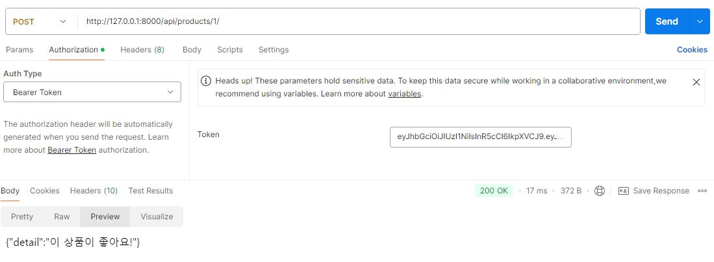

# Spartamarket_DRF
- 중고거래를 위한 플렛폼인 Spartamarket의 백엔드를 구축하는 과제
- 지난번 했던 과제와 유사하지만 DRF를 활용해서 백엔드 기능만을 구현해야한다.
## ERD
- 
## API specification
### /accounts
- Method: POST
    - 회원가입
    - 새로운 유저의 정보를 등록합니다. username, password, first_name, last_name, nickname, email, birth_day, gender, introduce를 입력받을 수 있으며 gender는 비공개가 가능하고 introduce는 생략가능합니다.
    - 
- Method: DELETE
    - 회원탈퇴
    - 현재 로그인중인 유저의 정보를 DB에서 삭제합니다.
    - 
### /accounts/login
- Method: POST
    - 로그인
    - DB에 등록된 회원일 경우 refresh token과 access token을 발급합니다. 등록되지 않을 회원이거나 비밀번호를 잘못 입력한 경우 지정한 메시지를 출력합니다.
    - 
    - 
### /accounts/token/refresh
- Method: POST
    - 토큰 재발급
    - refresh token을 이용해서 새로운 refresh token과 access token을 발급합니다.
    - 
### /accounts/logout
- Method: POST
    - 로그아웃
    - 요청을 보낸 사용자의 refresh token을 blacklist에 등록하여 더이상 인증되지 않도록 합니다. access token은 등록하지 않으며 자연스럽게 만료됩니다.
    - 
### /accounts/password
- Method: PUT
    - 비밀번호 수정
    - 로그인한 사용자는 자신의 비밀번호를 수정할 수 있습니다.
    - 
### /accounts/`<str:username>`
- Method: GET
    - 프로필 조회
    - 로그인한 사용자는 다른 유저의 정보를 조회할 수 있습니다. 로그인한 경우에만 사용할 수 있습니다.
    - 
- Method: POST
    - 팔로우
    - 로그인한 사용자는 다른유저를 팔로우 할 수 있습니다. 자기 자신을 팔로우 할 수는 없고 이미 팔로우한 상태에서 다시 요청을 보낼 경우 팔로우가 취소됩니다.
    - 
- Method: PUT
    - 회원정보 수정
    - 로그인한 사용자는 자신의 정보를 수정할 수 있습니다. 비밀번호는 수정할 수 없습니다.
    - 
### /products
- Method: GET
    - 상품목록 조회
    - 작성글 목록을 조회할 수 있습니다. 또한 작성글을 좋아요, 작성일 순으로 정렬할 수 있습니다.
    - 
- Method: POST
    - 상품등록
    - 로그인한 사용자는 게시글을 작성할 수 있습니다. 제목, 내용, 개격, 이미지, 카테고리, 태그를 지정할 수 있고 작성자와 작성시간은 자동으로 추가됩니다. 태그와 이미지는 필수적인 필드가 아닙니다.
    - 
    - 카테고리
    - 관리자는 admin페이지에서 카테고리를 추가할 수 있습니다. 사용자는 글을 작성할때 관리자가 지정한 카테고리중 하나를 선택할 수 있습니다. 또한 각 카테고리는 유일합니다.
    - 
    - 태그
    - 글 작성/수정시 태그를 설정할 수 있으며 해당 태그를 기준으로 글을 검색할 수 있습니다. 각 태그는 유일하며 항상 대문자로 입력됩니다.
    - 
### /products/search
- Method: GET
    - 작성글 검색
    - 사용자는 제목, 내용, 제목/내용, 작성자를 기준으로 글을 검색할 수 있습니다.
    - 
### /products/`<int:pk>`
- Method: GET
    - 글상세
    - 로그인한 사용자는 게시글을 클릭하여 상세한 내용을 확인할 수 있습니다.
    - 
- Method: POST
    - 좋아요
    - 로그인한 사용자는 원하는 상품에 좋아요를 표시할 수 있습니다.
    - 
- Method: PUT
- 상품수정
    - 로그인한 사용는 자신이 작성한 작성한 게시물을 수정할 수 있습니다.
    - 
- Method: DELETE
- 상품 삭제
    - 로그인한 사용자는 자신이 작성한 작성한 게시물을 삭제할 수 있습니다.
    - 